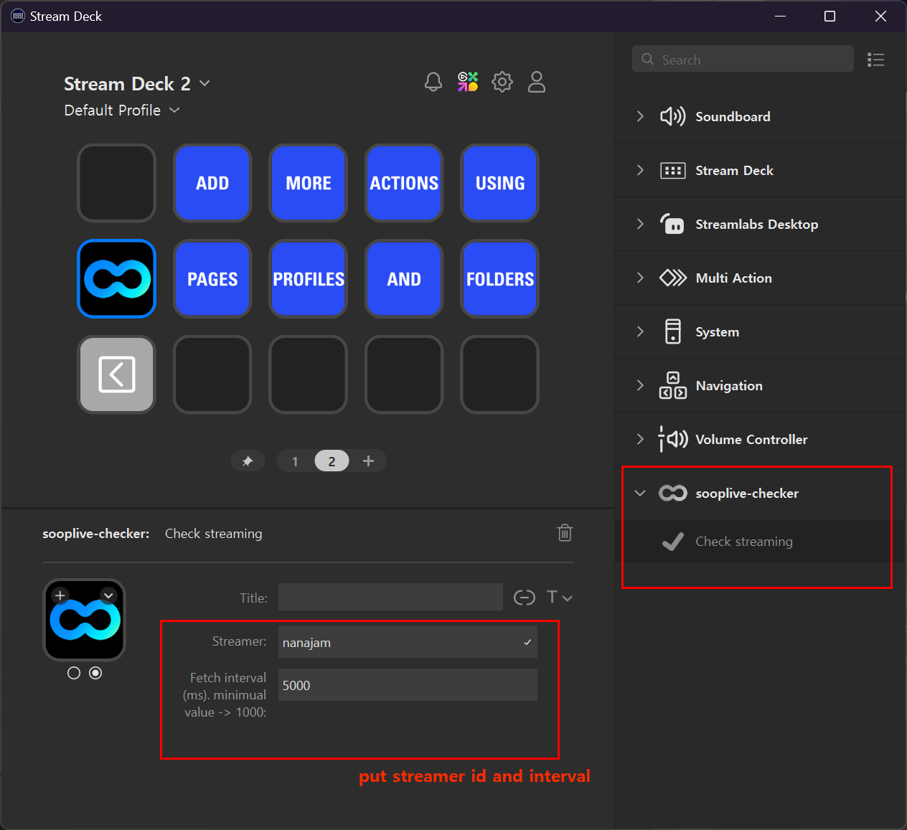

# Soop Live Streaming Checker

Soop Live Checker is plugin for SOOP Live, Korean streaming platform, previously AfreecaTV(아프리카TV).

With this Streamdeck plugin, you can check whether specified streaming is on air or not, just with key of Streamdeck.

## How to use

Just drag `Check streaming` action onto your page.

* Streamer : streamer id. Visit the channel page of the streamer, you can find streamder_id from URL like `https://ch.sooplive.co.kr/{streamer_id}`
* Fetch interval : Interval for check streaming. Minimum value is 1000 ms.

